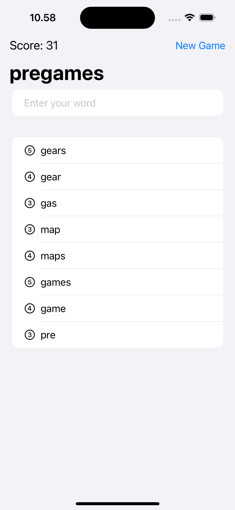

# WordScramble
A word game built with Swift and SwiftUI, challenging players to make words from a random eight-letter word.

---
The source learning is from 5th project of course "100 Days of SwiftUI" (https://www.hackingwithswift.com/100/swiftui)

---
## Game Features
1. **Game Display**  
   - Shows a random eight-letter word.
   - Includes a text field for players to submit word answers.
   - Displays the current score.
   - Lists all valid word answers created from the random eight-letter word.
   - A "New Game" button allows players to reset the game.

2. **Scoring**  
   - The score increases based on the number of letters in each valid word answer.

3. **Answer Validation**  
   - A new answer will be added to the list of answers if it meets all of the following criteria:
     - It consists only of letters from the random eight-letter word.
     - It is not already in the list of answers.
     - It contains more than two letters.
     - It is a real word.
     - It is not identical to the original eight-letter word.

4. **New Game Functionality**  
   - When the "New Game" button is tapped:
     - A new random eight-letter word is displayed.
     - The answer list is cleared.
     - The score is reset to zero.

# WordScramble – Image Comments Feature

---

